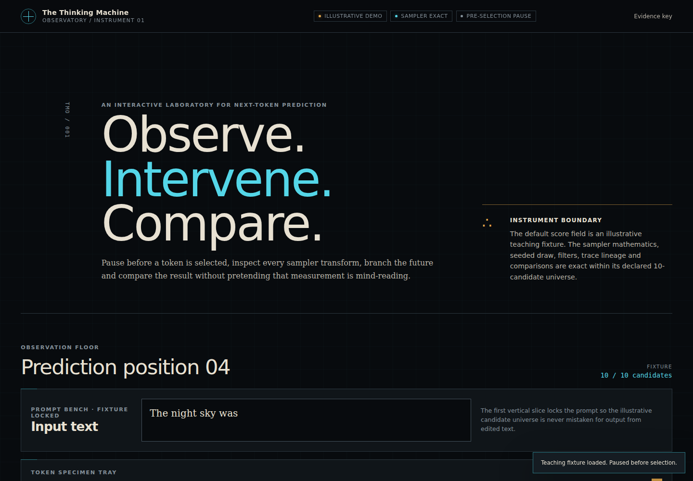

# The Thinking Machine Observatory

**Observe. Intervene. Compare.**

A local-first scientific instrument for inspecting next-token prediction, changing the sampler and preserving counterfactual branches as immutable traces.



## Current instrument

Phase 4 turns the verified multi-step branch observatory into a capability-gated learning instrument:

- an exact, deterministic sampler with temperature, top-k, top-p, greedy mode, suppression, forcing and xoshiro128\*\* seeded selection;
- a schema 1.2 ancestry bundle with content-addressed float32 payloads, explicit import limits and lossless schema 1.0/1.1 migration;
- candidate tables, entropy, selection explanations and Jensen–Shannon branch comparison;
- a responsive React observatory that can force the runner-up, suppress candidates, commit child traces and export JSON;
- all eight guided experiments as versioned protocols with executable observation predicates and append-only reflections;
- a pinned DistilGPT2 fp32 WASM worker that transfers all 50,257 final-position logits;
- source-framework golden vectors and accepted/rejected backend comparison reports;
- exact token-ID continuation, serialised PRNG cursors, explicit seed resets and stale-response-safe generation controls;
- immutable historical forks, first-divergence comparison and portable ancestor-complete export/import;
- transactional IndexedDB notebook storage with payload reference counts, quota preflight and parent-deletion protection; and
- a verified token specimen bench with visible boundaries, code points, derived UTF-8 bytes, a semantic table and copyable text;
- session-scoped capability declarations plus deliberate unavailable states for hidden states, attention, probes and projections; and
- unit, coverage and Playwright hero-loop tests in CI.

The default score field remains intentionally labelled **illustrative** so the instrument is immediately useful without a 327.8 MB download. Its ten logits are a teaching fixture, not model output. The optional fp32 WASM path is separately labelled **verified measured** and may enter exact sampling/replay. WebGPU fp16 remains measured but unverified.

## Run it

Requirements: Node.js 24+ and pnpm 11+.

```bash
pnpm install
pnpm dev
```

Open `http://localhost:5173`.

```bash
pnpm check          # formatting, lint, strict types, fixtures, unit tests and build
pnpm test:coverage  # exact-core coverage thresholds
pnpm build          # static production bundle
pnpm e2e            # Playwright hero-loop and responsive checks
```

Playwright requires its Chromium build once per development machine:

```bash
pnpm exec playwright install chromium
```

## Try the hero loop

1. Inspect the locked “The night sky was” teaching fixture.
2. Change temperature, top-k, top-p, mode or seed without mutating the baseline.
3. Suppress a candidate or choose **Force runner-up branch**.
4. Commit the preview as an immutable child trace.
5. Compare selection, entropy and Jensen–Shannon divergence in the Branch Chamber.
6. Export the selected schema-valid trace as JSON.

Or load **Verified WASM** in the full-vocabulary panel, pause on the complete distribution, advance or run several exact-prefix steps, fork a historical token, save locally and export/import its ancestry bundle. The initial implementation deliberately reruns the full token-ID prefix; it does not claim unverified KV-cache equivalence.

The token specimen bench follows the selected branch and pending step. Inspect the exact IDs and
decoded fragments, compare derived UTF-8 bytes in the table, then select a guided protocol. A
protocol reports observed, pending or blocked from its evidence predicates; saving a reflection
does not manufacture completion. Live-trace reflections travel with export and explicit notebook
saves.

## Architecture

The browser application consumes small packages rather than owning scientific logic itself.

| Workspace                   | Responsibility                                                       |
| --------------------------- | -------------------------------------------------------------------- |
| `apps/observatory`          | React shell, observatory design system and interaction orchestration |
| `packages/domain`           | Dependency-free scientific and trace vocabulary                      |
| `packages/sampler`          | Pure deterministic sampler and trace-owned PRNG                      |
| `packages/trace-schema`     | Legacy/compact schemas, replay, DAG lineage and local notebook       |
| `packages/instruments`      | Probability view models, comparisons and selection explanations      |
| `packages/experiments`      | Versionable guided experiment registry                               |
| `packages/inference-worker` | Typed worker protocol, capability detection and model adapter        |
| `fixtures/traces`           | Deterministic schema examples checked for drift in CI                |
| `model-tools`               | Pinned source generation, tolerances and backend evidence            |

The dependency direction is deliberate: UI and runtimes depend on the exact core; the exact core never depends on React, ONNX or a visual renderer.

## Scientific status

| Path                                | Source                                      | Status              | Allowed use                                                 |
| ----------------------------------- | ------------------------------------------- | ------------------- | ----------------------------------------------------------- |
| Teaching fixture                    | Ten authored candidate logits               | Illustrative        | Exact sampler learning, branching and replay demonstrations |
| Sampler and metrics                 | Pure TypeScript calculations                | Exact and tested    | Derived values and deterministic replay                     |
| Local DistilGPT2 WASM               | Pinned `Xenova/distilgpt2` fp32 graph       | Verified measured   | Full-vocabulary sampling and replay                         |
| Local DistilGPT2 WebGPU             | Pinned `Xenova/distilgpt2` fp16 graph       | Unverified measured | Inspection only; trace commitment disabled                  |
| Local DistilGPT2 int8               | Pinned graph and retained comparison report | Rejected            | Evidence only; never offered to the exact sampler           |
| Hidden states, attention and probes | Session capability registry                 | Unavailable         | Zero allocation; never simulated or inferred                |

The interface uses Measured, Derived, Projected, Probed and Interventional evidence labels. It does not claim to reveal thought, intent, consciousness or a complete causal explanation.

## Local model path

The optional worker uses `@huggingface/transformers@3.8.1`, pinned model/tokenizer revisions, fp32 on WASM and fp16 on WebGPU. Loading the accepted WASM graph may fetch 327.8 MB. Prompts and logits remain in the browser and no inference service is called.

The accepted `distilgpt2-wasm-fp32-v1` profile compares four complete vectors with the pinned PyTorch source: exact token IDs/fragments, exact top-1 and top-50 ordering, maximum absolute error below `0.000077` and zero causal-prefix error. The previously used int8 graph failed ranking and causal checks and is explicitly rejected. See the checked reports rather than treating the status label as self-authenticating.

The large, network-backed smoke is opt-in and intentionally excluded from ordinary CI:

```bash
RUN_LIVE_MODEL=1 pnpm exec playwright test tests/e2e/live-model.spec.ts
```

The ordinary offline-weight gate still re-hashes the checked full-vocabulary fixtures and proves the accepted hero vector selects/replays token `3223` (`" dark"`):

```bash
pnpm fixtures:check
pnpm trace:verify:live
```

## Privacy and storage

- No account or backend is required.
- No analytics or prompt telemetry is present.
- Model files use the browser/runtime cache.
- Compact trace bundles are downloaded only when the user explicitly exports them.
- IndexedDB persistence is explicit: the user chooses **Save to local notebook**. Payloads are deduplicated, quota failure is atomic and parents with descendants cannot be deleted accidentally.

## Documentation

- [Five-phase implementation plan](docs/implementation/00-five-phase-plan.md)
- [Contribution workflow](CONTRIBUTING.md)
- [Session 01 handover](docs/implementation/01-session-01-handover.md)
- [Session 02 handover](docs/implementation/02-session-02-handover.md)
- [Session 03 handover](docs/implementation/03-session-03-handover.md)
- [Session 04 handover](docs/implementation/04-session-04-handover.md)
- [Phase 4 readiness contract](docs/implementation/04-phase-04-readiness.md)
- [Architecture decisions](docs/adr)
- [Model verification boundary](model-tools/README.md)
- [Original product and architecture package](docs/00-project-overview-and-directors-brief.md)

## Next high-value slice

Phase 5 is release evidence, not feature expansion: accessibility and reduced-motion review,
measured browser/device capability results, memory and offline-revisit tests, deployment/security
decisions, licences and a two-minute first-use study. Hidden states, attention, logit-lens probes
and semantic projections remain unavailable until an exact purpose-built output profile passes the
independent gate.
