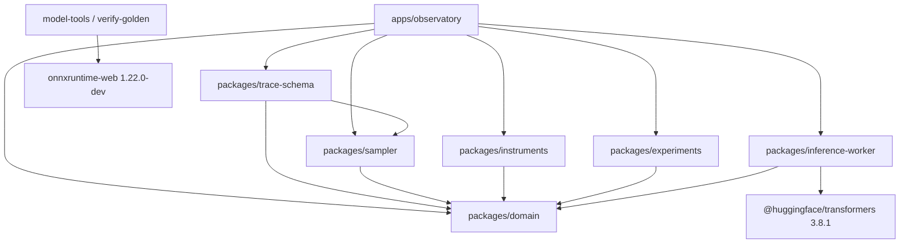

# Observatory architecture

This is the canonical, present-tense map of the implemented Phase 5 source candidate. The original
product documents describe intent; ADRs record decisions; implementation handovers record session
evidence. This directory explains how the current code fits together.

## Architectural shape

The Observatory is a static, local-first browser application. There is no application backend,
account system, analytics pipeline or prompt telemetry. A dedicated worker optionally runs a pinned
DistilGPT2 model; the illustrative instrument remains immediately available without the model
download.

The dependency rule is one-way: runtime and UI layers consume the exact core; the core does not know
about React, ONNX, Vite or rendering. The application may call public package APIs directly,
including `runSampler`. Browser inference loads Transformers.js; the Node golden path uses
`onnxruntime-web` as a verification-time dependency. Those are different programs bound by the
accepted WASM report, not by a shared import.

## Workspace responsibilities

| Workspace                   | Authority                                                                                      | Important exclusions                             |
| --------------------------- | ---------------------------------------------------------------------------------------------- | ------------------------------------------------ |
| `packages/domain`           | Types and evidence vocabulary shared across boundaries                                         | No runtime or framework dependency               |
| `packages/sampler`          | Stable softmax, filters, entropy, seeded selection and serialisable PRNG state                 | No UI state, model loading or persistence        |
| `packages/trace-schema`     | Strict schemas, deterministic replay, DAG lineage, payload verification and IndexedDB notebook | No inference and no visual policy                |
| `packages/instruments`      | Probability rows, token specimens, comparisons and mechanical explanations                     | Does not create evidence                         |
| `packages/experiments`      | Eight versioned protocols and executable observation predicates                                | Reflections cannot manufacture completion        |
| `packages/inference-worker` | Model identity, capability declarations, worker protocol and Transformers.js adapter           | Does not decide sampler truth or trace admission |
| `apps/observatory`          | User interaction, state orchestration, accessible tables and local file actions                | Does not reimplement sampler mathematics         |
| `model-tools`               | Pinned reference generation and accepted/rejected numerical reports                            | Not part of the browser production bundle        |
| `release-evidence`          | Acceptance mapping, candidate manifest and generated release decision                          | Does not create model evidence or waive a gate   |
| `scripts`                   | Reproducible release, contrast, policy and bundle checks                                       | Does not promote manual or missing evidence      |

## Runtime paths

| Path                           | Evidence status                            | Admission to exact trace                            | Network requirement                     |
| ------------------------------ | ------------------------------------------ | --------------------------------------------------- | --------------------------------------- |
| Ten-candidate teaching fixture | Illustrative inputs; exact derived sampler | Yes, within its declared complete teaching universe | None                                    |
| DistilGPT2 fp32 WASM           | Verified measured                          | Yes, with exact identities and 50,257 logits        | Initial model asset fetch unless cached |
| DistilGPT2 fp16 WebGPU         | Unverified measured                        | No; inspection only                                 | Initial model asset fetch unless cached |
| DistilGPT2 int8                | Rejected evidence                          | Never                                               | Not offered by the app                  |
| Secondary tensor instruments   | Unavailable                                | Never                                               | No tensors allocated                    |

Capability declarations are session-scoped. A UI label, model name or imported JSON field cannot
promote a path. Token specimens require the accepted tokenizer asset identity, not merely the model
repository and revision.

## Core architectural invariants

- The live fp32 path is bound to model, runtime, tokenizer and verification-profile identities.
- The accepted profile contains exactly 50,257 finite final-position logits.
- Generation continues from token IDs and a recorded PRNG cursor.
- Trace ancestry is immutable; child traces contain only post-fork steps.
- Compact logit payloads are canonical bytes, content-addressed and verified before replay.
- Imported files are size-bounded before their contents are read.
- IndexedDB writes are serialised and transactional; quota failure cannot partially replace state.
- Stale worker responses are rejected using generation ID, request order and worker epoch.

## Documentation topology

- [Documentation map](../README.md)
- [User guide](../user-guide.md)
- [Developer guide](../developer-guide.md)
- [Runtime and interaction flows](runtime-flows.md)
- [Trace, replay and persistence](trace-integrity.md)
- [Release, offline and deployment boundary](release-boundary.md)
- [Architecture decisions](../adr), including [ADR 0010](../adr/0010-static-host-wrangler-target.md)
  for the workspace-root Wrangler target
- [Implementation handovers](../implementation)
- [Model verification boundary](../../model-tools/README.md)
- [Agent and contributor contract](../../AGENTS.md)

When implementation and an old design document differ, the code plus accepted ADRs and current
verification evidence are authoritative. Update this architecture map in the same change that moves
a boundary.
