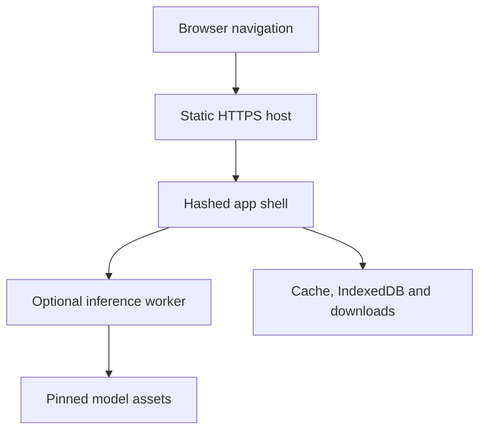

# Release, offline and deployment boundary

## Candidate and evidence commits

Phase 5 separates the source candidate from the evidence commit. The source candidate freezes
`apps/`, `packages/`, `fixtures/`, `tests/`, the lockfile and Playwright/Vitest configs. A later
evidence commit may update `release-evidence/`, `scripts/` and documentation, and binds the
manifest to that exact source SHA and dependency-lock hash. This avoids the impossible requirement
for a commit to contain its own hash while keeping every release claim reproducible. Changing a
frozen path requires a new candidate and invalidates prior browser artefacts.

The acceptance ledger maps all 78 criteria in document 07. Evidence records may cover several
criteria when one method establishes them together, but every criterion appears exactly once.
Validation rejects duplicate or missing coverage, unknown environments, missing artefacts, stale
summaries, threshold failures presented as passes and lockfile drift. Only `passed` satisfies a
launch-blocking criterion.

## Production runtime

The service worker is registered only in production builds. During installation it caches the root
HTML and the same-origin script and style assets named by that HTML. A navigation is **cache-first**:
the worker returns the cached shell when present and fetches only if that cache miss. Other
same-origin GET resources are also cache-first, then written through after a successful network
response. The worker does not intercept cross-origin model requests, does not create telemetry and
does not make an uncached first visit work offline.

`navigator.serviceWorker.register` currently omits `updateViaCache`. Cloudflare Pages is told
`Cache-Control: no-store` for `/service-worker.js`; `vite preview` does not apply
`apps/observatory/public/_headers`, so local preview is not a substitute for the deployed-origin
header smoke. A cache-name bump (`observatory-shell-v4` and later) is still required to drop a
stale shell.

IndexedDB trace persistence remains explicit and separate from the application cache. Clearing one
does not claim to clear the other. Exported JSON remains the portable user-controlled record.

## Static security contract

`apps/observatory/public/_headers` is part of the production artefact. It restricts sources with a
content security policy, prevents framing and object embedding, narrows browser permissions, avoids
referrer leakage and marks hashed assets immutable. The model path is the only cross-origin network
exception. Inline styles remain admitted for bounded probability-bar widths; inline scripts remain
denied.

Cross-origin model assets stay on the pinned upstream host. The application does not mirror weights
or claim the service worker provides offline model availability. Static-host policy is checked from
source, while the deployed-origin header smoke remains a distinct evidence record that cannot pass
until a real URL is observed.

The Cloudflare host builds from the repository root and deploys with `npx wrangler deploy`.
Repository-root `wrangler.toml` is the explicit static-asset target for that command: it names
`apps/observatory/dist` and does not introduce a Worker script. Wrangler stays a host tool, not a
workspace dependency. See [static release](../deployment/static-release.md) and
[ADR 0010](../adr/0010-static-host-wrangler-target.md).

## Browser and accessibility evidence

The ordinary Playwright configuration runs Chromium, Firefox and WebKit. The release suite covers
the illustrative hero loop, exact-data alternatives, keyboard _activation_ of the first experiment,
focus visibility on controls, 24-pixel control targets, reduced motion, 200% zoom proxy,
forced-colour treatment and a cached-shell fetch while the Playwright context is offline. The
offline journey does not reload the page. Fixture-worker journeys exercise the verified protocol
without relabelling the fixture as a model measurement. Real fp32 execution remains opt-in and
separately evidenced.

Automated results cannot replace screen-reader, physical-device, deployed-origin or moderated
learner observations. Those records name their environment and remain blocked or not-run when the
environment is unavailable.
