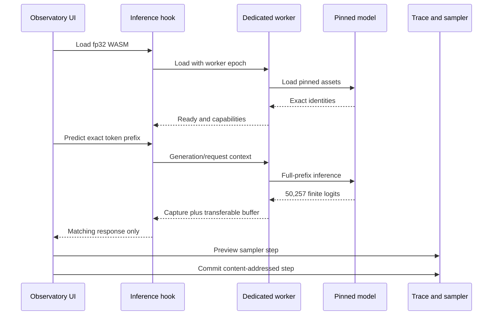
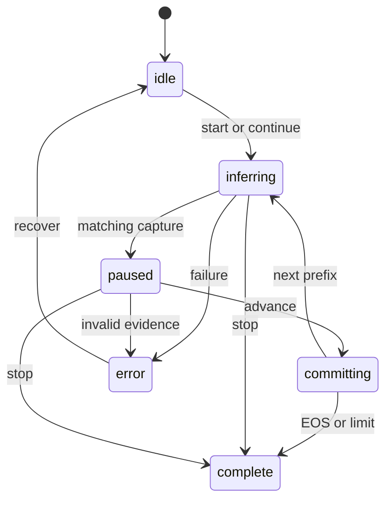

# Runtime and interaction flows

## Illustrative hero loop

The default path starts from a locked prompt and authored ten-logit universe. The sampler preview is
reversible. A commit creates a new immutable trace instead of mutating the baseline.

1. `apps/observatory/src/data/demo.ts` creates the fixture and baseline trace.
2. `packages/sampler` calculates every transform and selection record.
3. `packages/instruments` converts the record into tables, comparisons and explanations.
4. The user changes configuration, forces or suppresses a token, then commits a child trace.
5. The Branch Chamber compares the immutable baseline and child and can export schema 1.1 JSON.

The logits are illustrative. Exactness applies to calculations within the declared complete fixture,
not to a claim that DistilGPT2 produced those scores.

## Verified local generation

`useLiveInference` owns worker lifecycle and request identity. `LiveModelPanel` owns the generation
controller and trace orchestration. The worker owns model loading and inference, but cannot declare a
trace verified by itself: `apps/observatory/src/data/live.ts` independently checks all accepted
identities and vocabulary size before trace admission.

### Generation state machine

The controller state and worker request context must agree. Selecting another trace invalidates the
pending capture; continuing that trace creates a fresh request from its effective token-ID history.

## Branching

A trace node stores only steps created after its fork. Effective history is resolved recursively:

1. resolve the parent history;
2. take its prefix up to `forkStep`;
3. append the child node's contiguous steps; and
4. verify every step input equals prompt token IDs plus all prior effective selections.

Historical intervention reuses the source distribution payload and recorded incoming PRNG cursor,
then records the forced selection as a new child step. The ancestor bytes do not change.

## Import, export and notebook

Portable imports are rejected before file contents are read when the file exceeds 32 MiB. Parsed
schema 1.2 bundles then pass structural limits, payload hashes and deterministic replay. Replayable
schema 1.0/1.1 roots can migrate without inventing verification provenance.

The local notebook stores traces, metadata and deduplicated payloads in one IndexedDB transaction.
Writes are queued per notebook instance so rapid saves and deletes cannot race through stale
snapshots. Parent deletion is blocked while descendants remain.

## Failure behaviour

- Unsupported browser capability: disable the affected action and retain the teaching fixture.
- Model load or inference failure: show an error without changing evidence status.
- Stop: invalidate the active request but retain the loaded model and committed trace.
- Worker replacement: advance the epoch and reject replies from the old worker.
- Invalid/tampered import: fail before notebook persistence.
- Quota risk or `QuotaExceededError`: abort without replacing prior notebook records.
