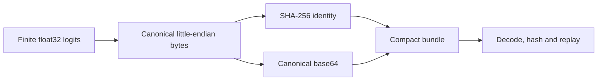

# Trace, replay and persistence integrity

Traces are evidence records, not ordinary mutable application state. Their job is to preserve enough
identity, input, calculation and lineage information to reproduce a selection without trusting the
rendering layer.

## Formats

| Schema | Role                                         | Candidate storage                                     | Current handling                             |
| ------ | -------------------------------------------- | ----------------------------------------------------- | -------------------------------------------- |
| 1.0    | Original expanded teaching trace             | Full candidate record per step                        | Strict parse; migrate only after replay      |
| 1.1    | Expanded trace with logit/profile provenance | Full candidate record per step                        | Supported for import and illustrative export |
| 1.2    | Compact multi-step ancestry bundle           | Canonical float32 payload plus compact sampler record | Current live format                          |
| 1.3    | Reserved secondary-output format             | Not defined                                           | Must not be emitted                          |

Schema version and evidence verification are separate. A structurally current trace is not
automatically verified model evidence.

## Compact bundle anatomy

A schema 1.2 bundle contains:

- a selected `rootTraceId`;
- one or more immutable trace nodes;
- explicit parent trace ID and fork step for children;
- prompt token specimens and exact input token IDs;
- compact sampler records with incoming/outgoing PRNG state;
- a map of SHA-256 keys to embedded float32 little-endian payloads; and
- append-only annotations.

Payload creation and use follow one path:

## Admission checks

Structural validation rejects, among other failures:

- unknown fields or schema versions;
- negative token IDs and malformed PRNG words;
- incomplete candidate universes or mismatched captured/declared sizes;
- missing, unused, oversized or wrongly keyed payloads;
- non-finite float32 values and non-canonical base64;
- duplicate trace IDs, missing ancestors, cycles or incompatible parents;
- non-contiguous step order or a fork beyond the parent history;
- input token prefixes that differ from the effective history;
- sampled selections whose recorded draw does not match the PRNG cursor;
- non-sampled selections that consume PRNG state; and
- annotations pointing beyond the trace's effective history.

An imported payload is hashed before any sampler consumes it. Every imported compact step is then
recomputed through the production sampler and compared with its recorded compact sampler record.

## Verified live profile

The fp32 live admission layer adds stricter checks:

- execution mode is `live-wasm`;
- model ID, revision, dtype, runtime and asset hash match the accepted profile;
- tokenizer ID, revision and asset hash match the accepted tokenizer bundle;
- every step identifies the accepted verification profile;
- every step's logit identity matches its payload reference; and
- every step contains the complete 50,257-token DistilGPT2 vocabulary.

The generic trace schema intentionally also supports small complete teaching universes. Only the
live admission layer binds a trace to DistilGPT2's vocabulary.

## Immutability and notebook storage

The notebook permits an existing trace to gain only new steps and new annotations. It rejects
rewritten lineage, removed steps, changed committed steps, removed annotations and payload hash
collisions. Payload reference counts allow branches to share identical distributions without
duplicating storage.

IndexedDB changes are computed from a consistent snapshot and replace the three stores in one
read-write transaction. Per-instance write serialisation prevents two rapid operations from reading
the same old snapshot and losing the first result. Storage estimation provides a safety margin, and
the actual quota exception remains the final authority.

## Evolution rules

1. Add a new schema only when the persisted meaning changes.
2. Preserve readers for accepted older formats or record an explicit compatibility break.
3. Migrate only after replay; never fill missing evidence with a new status.
4. Keep import limits and denial-of-service bounds explicit and tested.
5. Treat changes to float encoding, canonicalisation, sampler order or PRNG as versioned scientific
   changes requiring an ADR and new fixtures.
