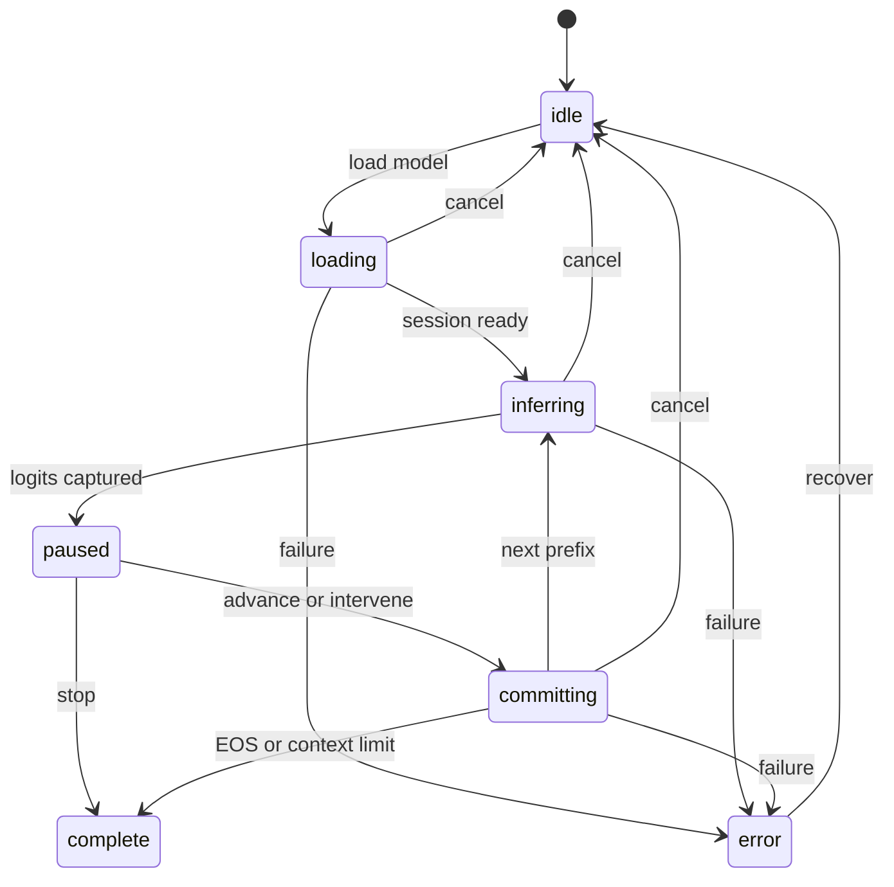

# Phase 3 readiness — multi-step generation and branch DAG

- Status: Implemented contract
- Depends on: Phase 2 draft PR #3
- Target outcome: several exact live steps on a baseline and child branch, export/import/replay without ancestor mutation

## Readiness result

Phase 2 closed the scientific uncertainty around the fp32 WASM measurement path. The remaining risk is structural: one expanded 50,257-candidate step is 23.06 MiB JSON. The readiness spike encodes the identical measured vector in 261.9 KiB JSON, verifies the same content address and deeply matches every production sampler field—a 98.89% reduction before schema integration.

This draft therefore fixes the order of work: compact evidence and PRNG continuity first, generation controls second, branch/notebook surfaces third. It does not widen into new instruments.

## Non-negotiable invariants

1. A step is committed only after complete verified inference and deterministic sampling both succeed.
2. Measured logits are stored once by the SHA-256 of canonical float32-le bytes.
3. Derived candidate fields may be recomputed or cached but never masquerade as independent measurements.
4. The root seed initialises the PRNG once. Normal next-token steps continue from the previous `stateAfter`; change-seed is an explicit intervention.
5. A child references its parent and fork position. Committing or deleting a child cannot mutate the ancestor.
6. A stale worker response cannot advance the active generation after cancel, prompt change, branch switch or a newer request.
7. Imported schema 1.0/1.1 traces remain readable and never gain invented verification evidence.
8. WebGPU remains inspection-only until it passes its own golden profile.

## Proposed trace 1.2 shape

| Record         | Owns                                                                                                         | Does not duplicate                           |
| -------------- | ------------------------------------------------------------------------------------------------------------ | -------------------------------------------- |
| Trace root     | model/tokenizer/calculation identities, root seed, embedded payload map                                      | ancestor steps                               |
| Payload        | encoding, value count, SHA-256, canonical base64 bytes                                                       | sampler transforms                           |
| Step           | input IDs, payload reference, config, interventions, selection, PRNG before/after, decoded display specimens | full expanded candidate records              |
| Branch         | parent trace ID, exact fork step, divergent steps                                                            | parent payloads already resolved by notebook |
| Notebook index | trace metadata, ancestry and content-address reference counts                                                | embedded payload bytes per trace             |

Portable JSON export embeds every transitively required payload once. IndexedDB storage separates payload and trace stores so branches deduplicate bytes. Import first verifies payloads, then ancestry, then deterministic replay.

## Generation controller

The controller owns a `generationId`, monotonic `requestOrder` and worker epoch. Every response carries all three; a mismatch is ignored and tested. “Run” is repeated advance, not a separate scientific operation. “Pause” stops before the next sampling action, leaving the complete measured distribution inspectable. Initial correctness may rerun the full prefix each step; KV-cache optimisation needs separate equivalence evidence.

Explicit states:

- `idle` — no model task, illustrative path intact;
- `loading` — cancellable model acquisition/session creation;
- `inferring` — full-prefix request in worker;
- `paused-before-selection` — complete logits available, no sampler action committed;
- `committing` — exact sampler result and immutable step being validated;
- `complete` — EOS, context limit or user stop; and
- `error` — recoverable message plus last immutable trace.

Continuous run is an `autoAdvance` controller flag, not another scientific state. It schedules the next commit only when `paused-before-selection` is reached and must clear on pause, cancel, intervention or error.

## Bounded work packages

### 3A — Compact schema and replay

- integrate the verified codec into schema 1.2;
- add content-addressed payload and lightweight step schemas;
- validate SHA/length/finiteness before replay;
- migrate 1.1 expanded steps to a canonical in-memory view;
- prove sampler equivalence with the checked hero vector; and
- set explicit limits for payload count, vector length and import bytes.

Exit: 1.1 and 1.2 versions select the same token and expose equivalent sampler records; compact export is under 400 KiB for the hero step.

### 3B — PRNG cursor and multi-step core

- extend the sampler to accept an explicit xoshiro state as well as a root seed;
- make seed reset an intervention record;
- append selected token IDs to the exact prefix;
- define EOS and 64-token default context termination; and
- add pure transition tests for advance, pause, resume, stop and cancel.

Exit: five steps replay from recorded state without re-seeding or loading a model.

### 3C — Worker/controller integration

- add generation/request/epoch IDs to the typed protocol;
- reject stale responses;
- dispose tensors/session on cancel and model switch;
- retain the complete distribution only for committed or currently paused steps; and
- surface honest cold/warm/error recovery.

Exit: cancel during load/inference cannot append a step; a new run starts cleanly.

### 3D — Branch DAG and interventions

- resolve effective histories from immutable ancestry;
- fork from any compatible historical step;
- support force, suppress, greedy, change-seed and prior-token interventions;
- run baseline and child for several steps; and
- synchronise comparison from the shared ancestor.

Exit: force the runner-up, advance both futures and locate the first divergence without copying or mutating ancestor steps.

### 3E — Notebook persistence

- IndexedDB stores for traces, payloads and metadata;
- transactions and content-address reference counts;
- quota preflight, failure recovery and explicit local-data report;
- delete policy for parents with descendants; and
- portable export/import with missing-ancestor diagnostics.

Exit: reload, import and replay work offline when model/payload caches are present; quota failure leaves prior records intact.

### 3F — Product and browser evidence

- advance/run/pause/stop controls with keyboard and live-region coverage;
- timeline and Branch Chamber driven by resolved multi-step traces;
- accessible exact-data alternatives and responsive review;
- Chromium hero E2E for multi-step baseline/child/export/import; and
- opt-in verified-model E2E on a host that permits browser execution.

Exit: the Phase 3 scenario passes from both a checked fixture and genuine verified WASM capture.

## Test matrix

| Layer         | Required proof                                                               |
| ------------- | ---------------------------------------------------------------------------- |
| Payload codec | endian/base64 determinism, hash, truncation, tamper and non-finite rejection |
| Schema        | 1.0 → 1.1 → 1.2 compatibility, unknown-field limits, payload deduplication   |
| Sampler       | explicit cursor continuation, seed reset, forced/suppressed edge cases       |
| Controller    | stale-response rejection, cancel at every state, error recovery              |
| DAG           | ancestor immutability, fork resolution, missing/cyclic parent rejection      |
| Storage       | atomic writes, quota error, reference counting, delete policy                |
| Browser       | multi-step pause/branch/replay, keyboard, reduced motion and mobile overflow |

Property/fuzz coverage should target import limits, DAG cycles and state-event sequences. It must not generate enormous unchecked values that turn validation into a denial-of-service path.

## Decisions for review before 3A merges

- Whether schema 1.2 stores a small derived top-candidate snapshot for instant rendering or computes every view lazily.
- Whether a portable child export materialises ancestor metadata/payloads or exports a bundle containing multiple traces.
- Parent deletion policy in the notebook: prevent by default is safest; materialisation may be offered explicitly.
- Exact import byte/vector/count ceilings for desktop and reduced-capability modes.

## Deliberate non-goals

- attention, hidden-state, logit-lens or semantic projections;
- a new model or WebGPU verification campaign;
- collaborative/backend accounts;
- KV-cache optimisation without golden equivalence; and
- arbitrary external tensor URLs in trusted trace import.

Implementation followed the required order: schema migration and compact replay, then PRNG/controller correctness, then branch/notebook/product surfaces. The readiness spike was treated as representation evidence rather than a shortcut around migration.

## Implemented decisions

- Schema 1.2 stores a bounded decoded top-candidate snapshot for immediate rendering; every probability, filter stage and rank remains derived from the referenced payload.
- Portable child export is an ancestry bundle: trace nodes and every transitively required payload appear once.
- Notebook parent deletion is prevented while descendants exist. Users delete descendants first; silent cascade/materialisation is not implemented.
- Imports are rejected before payload allocation above 32 MiB JSON, 256 payloads, 4,000,000 total float32 values, 128 traces, 1,024 total steps, 256 local steps per trace or 200 decoded candidates per step.

The completed evidence and remaining browser boundary are recorded in [Session 03 handover](03-session-03-handover.md).
